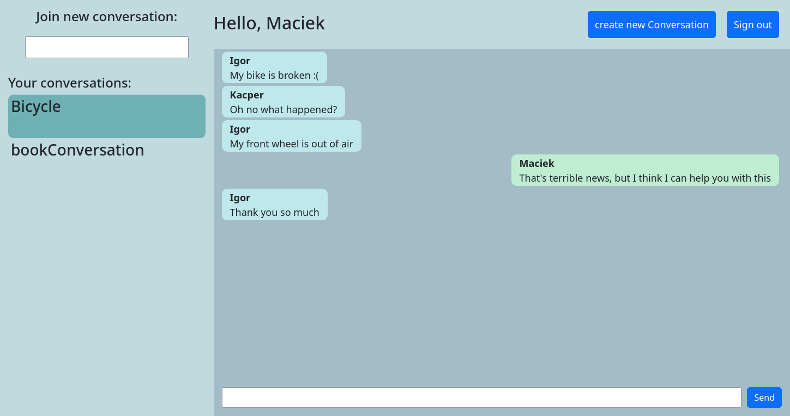

# Chat Application Frontend

---
Real-time chatting application. This repository contains only a graphical user interface. Webserver can be found here:
https://github.com/WaShindeiru/Chat

## Features

---
* Real-time communication using websocket
* Creating new users and conversations
* Sending messages to users/conversations

## Gallery

---
<div>

</div>

## Tools I used:

---
* TypeScript
* Angular

## Getting Started

---
### Prerequisites
* Make sure Node.js is installed

### Build Instructions

---
Make sure you are in a project directory, then run:

```bash
npm install
npm start
```

Next, go to:
```
http://localhost:4200
```

To work correctly, this application needs the webserver to be active. Details can be found here:
https://github.com/WaShindeiru/ChatAngular
